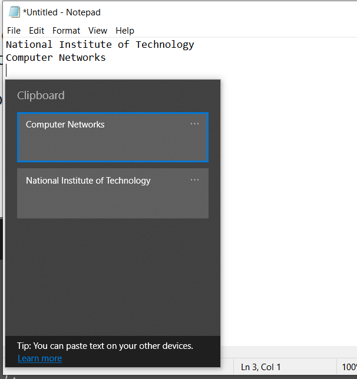

**Linux Clipboard:**

This directory contains code for device driver, which stores clipboard history, and provides functionality to add a new string to the list, change the head of the list(when read the data in the *new head* is returned).

**Motivation:**

In the Windows OS, there is a functionality where one can access previously copied data on the clipboard and select one and paste it (which can be accessed via Win+V)

For example, we first copied *National Institute of Technology* first, and then *Computer Networks* (using Ctrl+C twice).

The result is as below, after pressing Win+V

Unfortunatelty(or fortunately for us 🙃), this feature is not implemented in Linux.

**Functionalties-Usage**:

We can **add** a string to the clipboard by writing *!add `<string>`*

We can **change** the currString/head of the clipboard by writing *!change `<index of the string>`*

We can **print** the contents of the clipboard by writing *!print* (they will be written to system logs)

We can **popback** the contents of the clipboard by writing *!popback.*

We can **get current string** by reading from the device driver file.

**PS:** There is a interactive program called interface.c which implements these functionalities as an illustration.
